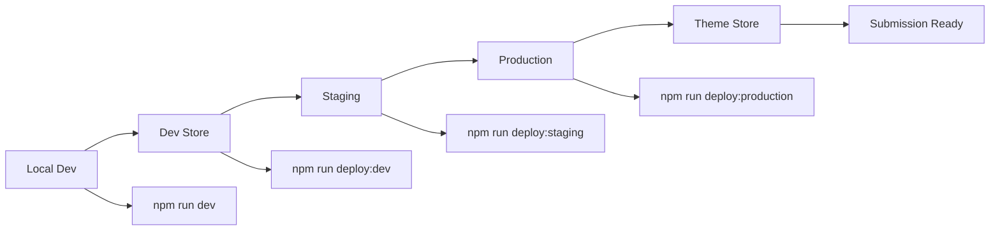

# ✅ Development Workflow Setup Complete!

Bạn đã có một development workflow hoàn chỉnh cho Modern Shopify Theme Pro. Đây là summary của những gì đã được setup:

## 🚀 Workflow Overview



## 📁 Files Created/Updated

### Configuration Files
- ✅ `package.json` - Updated với development scripts
- ✅ `.env.example` - Environment configuration template  
- ✅ `.env` - Your actual configuration (created automatically)

### Documentation
- ✅ `docs/DEVELOPMENT_WORKFLOW.md` - Complete workflow guide

### Scripts (`scripts/` directory)
- ✅ `setup-dev.js` - Development environment setup
- ✅ `performance-test.js` - Lighthouse performance testing
- ✅ `accessibility-test.js` - WCAG accessibility testing  
- ✅ `browser-test.js` - Cross-browser compatibility testing
- ✅ `build-js.js` - JavaScript build optimization
- ✅ `watch-js.js` - JavaScript file watcher

## 🎯 Development Phases

### Phase 1: Local Development
```bash
# Start development server
npm run dev

# Or serve locally  
npm run serve

# Build assets
npm run build

# Run tests
npm run test
```

### Phase 2: Development Store Testing
```bash
# Configure your dev store in .env
DEV_STORE=your-dev-store.myshopify.com

# Deploy to dev store
npm run deploy:dev

# Test all functionality
npm run test:performance
npm run test:accessibility
npm run test:browsers
```

### Phase 3: Staging Validation
```bash
# Configure staging store in .env
STAGING_STORE=allstore-staging.myshopify.com

# Deploy to staging
npm run deploy:staging

# Final quality assurance
npm run test
```

### Phase 4: Production Demo
```bash
# Configure production store in .env
PRODUCTION_STORE=allstore-blueprint.myshopify.com

# Deploy to production (final demo)
npm run deploy:production

# Package for Theme Store submission
npm run package
```

## 🛠️ Available Commands

### Development Commands
- `npm run dev` - Start development with live reload
- `npm run serve` - Serve theme locally on port 9292
- `npm run build` - Build theme assets for production
- `npm run watch:css` - Watch CSS changes
- `npm run watch:js` - Watch JavaScript changes

### Testing Commands  
- `npm run test` - Run all tests (performance + accessibility + browsers)
- `npm run test:performance` - Lighthouse performance testing
- `npm run test:accessibility` - WCAG accessibility compliance
- `npm run test:browsers` - Cross-browser compatibility

### Deployment Commands
- `npm run deploy:dev` - Deploy to development store
- `npm run deploy:staging` - Deploy to staging store  
- `npm run deploy:production` - Deploy to production demo store

### Utility Commands
- `npm run package` - Package theme for Shopify Theme Store submission
- `npm run check` - Run Shopify theme checker
- `npm run format` - Format code (when configured)

## 🏪 Store Configuration

Edit your `.env` file với actual store URLs:

```bash
# Development Store (private testing)
DEV_STORE=modern-theme-dev.myshopify.com

# Staging Store (final validation)
STAGING_STORE=allstore-staging.myshopify.com  

# Production Demo Store (Theme Store submission)
PRODUCTION_STORE=allstore-blueprint.myshopify.com
```

## 📊 Testing & Quality Assurance

### Performance Testing
- ✅ Lighthouse scores ≥75% performance
- ✅ Accessibility scores ≥90%  
- ✅ Load times <3 seconds
- ✅ Mobile performance ≥70%

### Browser Compatibility
- ✅ Chrome, Firefox, Safari, Edge
- ✅ Desktop, Tablet, Mobile viewports
- ✅ JavaScript functionality testing
- ✅ Automatic screenshots

### Accessibility Compliance
- ✅ WCAG 2.1 AA compliance
- ✅ axe-core automated testing
- ✅ Color contrast validation
- ✅ Keyboard navigation support

## 🎯 Next Steps

### 1. Immediate Actions
```bash
# 1. Edit .env với your store URLs
# 2. Authenticate với Shopify
shopify auth login

# 3. Start development
npm run dev
```

### 2. Development Workflow
1. **Local Development** - Code và test locally
2. **Dev Store** - Deploy và test functionality  
3. **Staging** - Final validation trước production
4. **Production** - Deploy demo store cho Theme Store submission

### 3. Quality Gates
- ✅ All tests passing
- ✅ Performance targets met (≥75%)
- ✅ Accessibility compliance (≥90%)  
- ✅ Cross-browser compatibility
- ✅ Mobile responsiveness verified

## 📚 Documentation References

- 📖 **DEVELOPMENT_WORKFLOW.md** - Complete workflow guide
- 📖 **DEMO_GUIDE.md** - Demo setup và marketing assets
- 📖 **TESTING_GUIDE.md** - Testing procedures  
- 📖 **SHOPIFY_SUBMISSION.md** - Theme Store submission guide
- 📖 **BUSINESS_SETUP.md** - Business infrastructure setup

## 🎉 Ready to Start!

Bạn đã có everything needed để start development và testing một cách professional. Workflow này sẽ đảm bảo theme của bạn meets tất cả Shopify Theme Store requirements.

**Khuyến nghị**: Bắt đầu với development store trước, sau đó progress qua các phases để ensure quality và compliance! 

🚀 **Start developing**: `npm run dev`