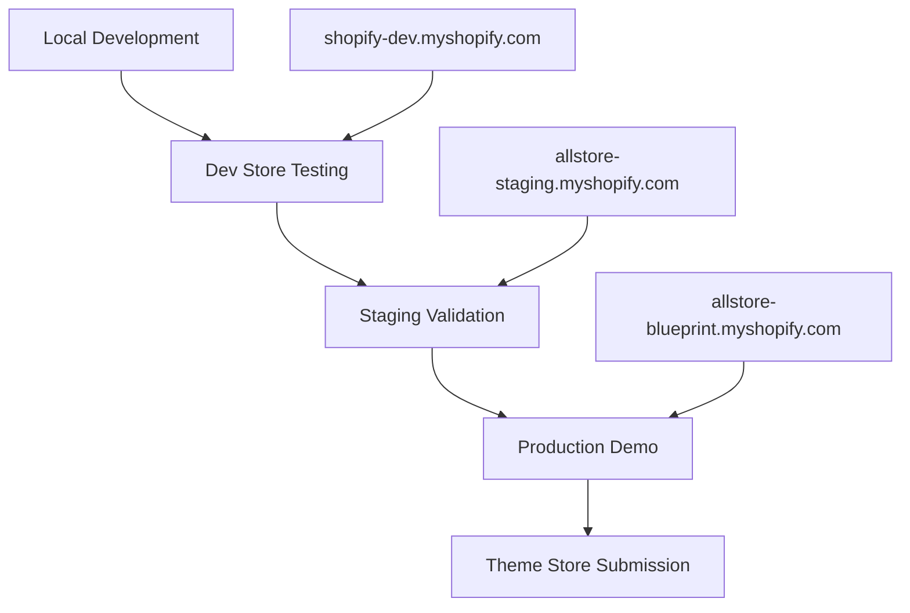

# 🔧 Development Workflow - Modern Shopify Theme Pro

Complete development workflow from local testing to Theme Store submission.

## 🎯 Development Phases Overview



## 🏗️ Phase 1: Local Development

### Setup Development Environment
```bash
# 1. Install Shopify CLI
npm install -g @shopify/cli @shopify/theme

# 2. Authenticate with Shopify Partners
shopify auth login

# 3. Create development store
shopify store create --name="modern-theme-dev" --type=development

# 4. Initialize theme development
shopify theme init
```

### Local Development Server
```bash
# Start development server with live reload
shopify theme dev --store=your-dev-store.myshopify.com

# Or serve locally for theme testing
cd c:/workspaces/modern-shopify-theme
shopify theme serve --port=9292
```

### Local Testing Checklist
```bash
✅ Development Tasks:
□ Theme compilation successful
□ All sections render correctly
□ Demo presets load properly
□ CSS/JS bundling works
□ Performance optimization applied
□ Accessibility compliance checked
□ Cross-browser compatibility verified
□ Mobile responsiveness confirmed
```

## 🧪 Phase 2: Development Store Testing

### Create Development Store
```bash
# Shopify Partners Dashboard
1. Go to https://partners.shopify.com
2. Apps > Development stores
3. Create store: "modern-theme-dev" 
4. Store URL: your-dev-store.myshopify.com
5. Enable password protection: YES (for private testing)
```

### Deploy to Dev Store
```bash
# Method 1: Shopify CLI (Recommended)
shopify theme push --store=your-dev-store.myshopify.com

# Method 2: Manual Upload
1. ZIP theme files
2. Online Store > Themes > Upload theme
3. Publish for testing

# Method 3: GitHub Integration
git push origin development
# Auto-deploy via GitHub Actions (if configured)
```

### Development Store Configuration
```bash
# Store Setup:
├── Store Name: "Modern Theme Dev"
├── Password: "dev2024!" (temporary)
├── Demo Products: Import demo-products.csv
├── Collections: Setup test collections
├── Pages: Create essential pages
├── Blog: Add sample blog posts
└── Settings: Configure theme settings

# Admin Access:
└── URL: your-dev-store.myshopify.com/admin
└── Theme Customizer: /admin/themes/current/editor
```

### Dev Store Testing Checklist
```bash
🧪 Functionality Testing:
□ All demo presets work (?demo=fashion, etc.)
□ Product pages load correctly
□ Cart functionality working
□ Search and filtering operational
□ Newsletter signup functional
□ Contact forms submitting
□ Navigation menu responsive
□ Footer links working

🎨 Design Testing:
□ Typography renders correctly
□ Color schemes apply properly
□ Images load and resize correctly
□ Animations smooth and appropriate
□ Mobile layout optimized
□ Cross-browser compatibility confirmed

⚡ Performance Testing:
□ Lighthouse scores ≥75%
□ Page load times <3 seconds
□ Mobile performance ≥70%
□ Images optimized and compressed
□ CSS/JS minified and bundled
```

## 🚀 Phase 3: Staging Validation

### Create Staging Store
```bash
# Purpose: Final validation before production
Store Name: "AllStore Staging"
Store URL: allstore-staging.myshopify.com
Password: "staging2024!" (temporary)
Purpose: Final pre-production testing
```

### Staging Deployment
```bash
# Deploy stable version to staging
git checkout main
shopify theme push --store=allstore-staging.myshopify.com

# Or manual deployment
1. Export from dev store
2. Import to staging store
3. Configure theme settings
4. Test all functionality
```

### Staging Testing Protocol
```bash
🔍 Quality Assurance:
□ Full regression testing completed
□ All demo presets functional
□ Performance benchmarks met
□ Accessibility audit passed (≥90%)
□ Browser compatibility confirmed
□ Mobile experience optimized
□ SEO optimization validated
□ Security scan completed

📊 Performance Validation:
□ Lighthouse Performance: ≥75%
□ Lighthouse Accessibility: ≥90%
□ Lighthouse Best Practices: ≥90%
□ Lighthouse SEO: ≥90%
□ GTMetrix Grade: A or B
□ WebPageTest Speed Index: <3s

📝 Content Review:
□ No lorem ipsum text remaining
□ Professional product descriptions
□ Realistic pricing and inventory
□ Complete store policies
□ Working contact information
□ Proper meta descriptions
□ Social media integration
```

## 🎯 Phase 4: Production Demo Store

### Production Store Setup
```bash
# Final demo store for Theme Store submission
Store Name: "AllStore Blueprint"
Store URL: allstore-blueprint.myshopify.com
Password: DISABLED (public access required)
Purpose: Official Theme Store submission demo
```

### Production Deployment
```bash
# Deploy final version
git checkout main
git pull origin main
shopify theme push --store=allstore-blueprint.myshopify.com --live

# Verify deployment
curl -I https://allstore-blueprint.myshopify.com
# Should return 200 OK without password redirect
```

### Production Configuration
```bash
🏪 Store Settings:
├── Password Protection: DISABLED
├── Store Availability: Online
├── Checkout: Guest checkout enabled
├── Taxes: Configured for demo purposes
├── Shipping: Free shipping setup
├── Payments: Test mode payment gateways
├── Notifications: Configured email templates
└── Legal: Privacy policy, Terms of service

🎨 Theme Configuration:
├── Demo Presets: All 4 types configured
├── Home Page: Optimized for conversion
├── Product Pages: Complete with reviews
├── Collection Pages: Proper filtering
├── Cart: Drawer and page options
├── Search: Predictive search enabled
└── Blog: Sample content published
```

### Production Validation
```bash
📋 Final Checklist:
□ Store accessible without password
□ All demo URLs functional:
  □ https://allstore-blueprint.myshopify.com
  □ https://allstore-blueprint.myshopify.com/?demo=fashion
  □ https://allstore-blueprint.myshopify.com/?demo=electronics  
  □ https://allstore-blueprint.myshopify.com/?demo=beauty
  □ https://allstore-blueprint.myshopify.com/?demo=minimal

□ Performance meets requirements:
  □ Lighthouse Performance ≥75%
  □ Lighthouse Accessibility ≥90%
  □ Mobile Performance ≥70%
  □ Load time <3 seconds

□ Content quality verified:
  □ Professional product images
  □ Realistic product descriptions
  □ Complete store information
  □ Working contact forms
  □ No broken links or images
```

## 🚢 Phase 5: Theme Store Submission

### Pre-Submission Checklist
```bash
📦 Submission Package:
□ Theme files packaged correctly
□ Documentation complete (README.md)
□ Demo store fully functional
□ Marketing assets prepared
□ Legal requirements met
□ Partner account in good standing

🎥 Marketing Assets:
□ Screenshots (1920x1080 desktop)
□ Screenshots (375x812 mobile)
□ Demo video (60 seconds max)
□ Theme description written
□ Feature highlights documented
□ Pricing strategy determined
```

### Submission Process
```bash
# 1. Login to Shopify Partners
https://partners.shopify.com

# 2. Navigate to Themes section
Partners Dashboard > Themes > Create theme

# 3. Submit theme package
├── Theme ZIP file
├── Demo store URL: allstore-blueprint.myshopify.com
├── Documentation package
├── Marketing assets
└── Legal information

# 4. Review and submit
Review checklist > Submit for review
```

## 🔄 Development Commands Reference

### Shopify CLI Commands
```bash
# Authentication
shopify auth login
shopify auth logout

# Store management
shopify store list
shopify store create --name="store-name"

# Theme development
shopify theme dev --store=your-store.myshopify.com
shopify theme push --store=your-store.myshopify.com
shopify theme pull --store=your-store.myshopify.com
shopify theme package

# Theme testing
shopify theme check
shopify theme serve --port=9292
```

### Local Development Commands
```bash
# Install dependencies
npm install

# Build theme assets
npm run build

# Development server
npm run dev

# Performance testing
npm run test:performance

# Accessibility testing  
npm run test:accessibility

# Browser testing
npm run test:browsers

# Full test suite
npm run test
```

### Git Workflow
```bash
# Feature development
git checkout -b feature/new-feature
git add .
git commit -m "Add new feature"
git push origin feature/new-feature

# Merge to development
git checkout development
git merge feature/new-feature

# Deploy to dev store
shopify theme push --store=your-dev-store.myshopify.com

# Release to main
git checkout main
git merge development
git tag v1.0.0
git push origin main --tags

# Deploy to production
shopify theme push --store=allstore-blueprint.myshopify.com --live
```

## 🐛 Troubleshooting

### Common Development Issues
```bash
# Theme compilation errors
1. Check syntax in Liquid files
2. Verify asset paths are correct
3. Ensure required files exist
4. Review browser console for errors

# Deployment failures
1. Verify store credentials
2. Check internet connection
3. Ensure store is accessible
4. Review file permissions

# Performance issues
1. Optimize images and fonts
2. Minify CSS and JavaScript
3. Enable browser caching
4. Reduce HTTP requests

# Demo preset problems
1. Check demo-setup.js loading
2. Verify preset data structure
3. Ensure CSS variables defined
4. Test URL parameter handling
```

### Support Resources
```bash
# Documentation
├── Shopify Theme Development: https://shopify.dev/themes
├── Shopify CLI: https://shopify.dev/tools/cli
├── Liquid Reference: https://shopify.dev/api/liquid
└── Theme Store Requirements: https://shopify.dev/themes/store

# Community
├── Shopify Community: https://community.shopify.com
├── Discord: Shopify Developers
├── GitHub: Theme issues and discussions
└── Stack Overflow: shopify-liquid tag
```

## 📊 Development Metrics

### Performance Targets
```bash
Development Phase:
├── Local Build Time: <30 seconds
├── Dev Server Start: <10 seconds
├── Hot Reload: <2 seconds
└── Asset Compilation: <15 seconds

Staging Phase:
├── Lighthouse Performance: ≥75%
├── Lighthouse Accessibility: ≥85%
├── Page Load Time: <4 seconds
└── Mobile Performance: ≥65%

Production Phase:
├── Lighthouse Performance: ≥75%
├── Lighthouse Accessibility: ≥90%
├── Page Load Time: <3 seconds
├── Mobile Performance: ≥70%
└── SEO Score: ≥90%
```

### Quality Gates
```bash
Cannot proceed to next phase until:
✅ All tests passing
✅ Performance targets met
✅ Accessibility compliance achieved
✅ Cross-browser compatibility confirmed
✅ Mobile responsiveness verified
✅ Security scan clean
✅ Code review completed
✅ Documentation updated
```

---

**Ready to start development? Follow the phases sequentially for best results! 🚀**

Start with: `shopify theme dev --store=your-dev-store.myshopify.com`